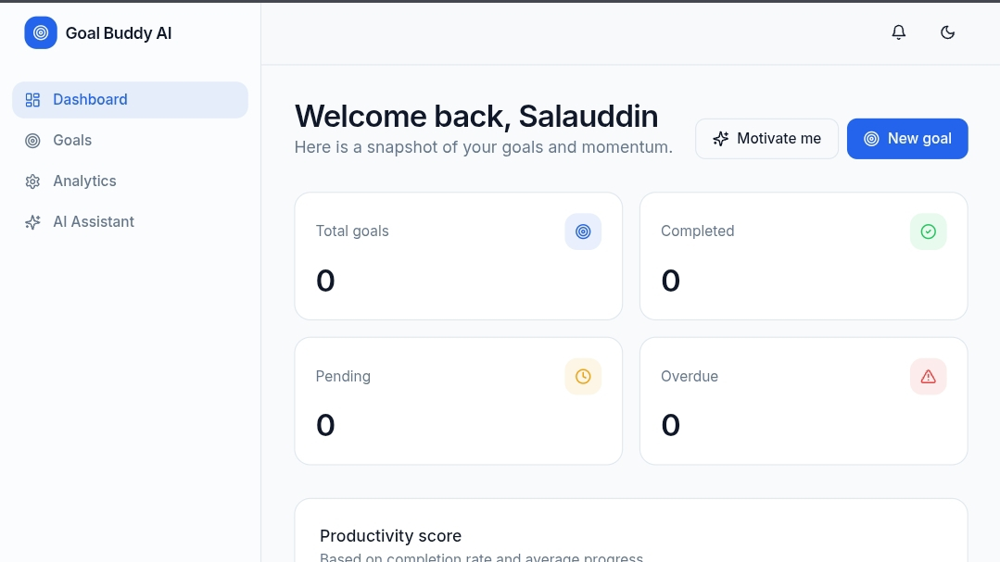

# 🎯 Goal Tracker AI

Goal Tracker AI is a modern web application that helps users create, manage, and achieve their personal goals with AI-powered motivation and progress tracking.

## 🔗 Live Demo:

https://goal-tracker-ai.vercel.app

## ✨ Features

- 🔐 Secure Authentication (Better Auth + JWT)
- 🎯 Create, Update & Delete Goals
- 📊 Goal Progress Dashboard
- 📈 Progress Charts using Recharts
- 🤖 AI Motivational Messages
- 🔔 Smart Goal Reminders
- 🌙 Dark & Light Mode
- 📱 Fully Responsive Design
- ⚡ Fast Performance with Next.js
- 🔄 Real-time Data Fetching using TanStack Query

---

## 🛠️ Tech Stack

### Frontend

- Next.js
- TypeScript
- Tailwind CSS
- TanStack Query
- Recharts
- Framer Motion
- React Hook Form
- Axios

### Backend

- Express.js
- Node.js
- TypeScript
- MongoDB
- Better Auth
- JWT

### AI

- OpenAI API (or any AI Provider)

---

## 📂 Project Structure

```
goal-tracker-client
│
├── app
├── components
├── hooks
├── lib
├── services
├── types
├── public
├── styles
├── package.json
└── README.md
```

---

## 🚀 Getting Started

### Clone Repository 
git clone https://github.com/Gazi-Md-Salauddin/goal-tracker-ai.git
```

### Go to Project

```bash
cd goal-tracker-ai
```

### Install Dependencies

```bash
npm install
```


### Start Development Server

```bash
npm run dev
```

---

## 📸 Screenshots
### Home Page


### Dashboard




---

## 📌 Future Improvements

- AI Goal Suggestions
- Weekly Reports
- Email Notifications
- Habit Tracker
- Calendar Integration
- Team Goals
- Mobile App

---

## 👨‍💻 Author

**Gazi Md Salauddin**

GitHub:
https://github.com/Gazi-Md-Salauddin
